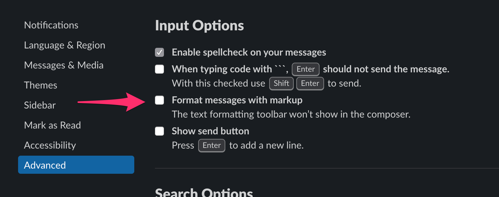

# Slack Disable WYSIWYG Bookmarklet

*Disables the WYSIWYG editor in Slack.*

## Update

**As of 2019-12-02 Slack
[supports reverting back](https://twitter.com/SlackHQ/status/1201955273667158023)
to its previous editor!**
Instead of using this repo, please
[enable this feature](https://slack.com/help/articles/360039953113) via Slack's
preferences:
1. Click your workspace name in the top left
2. Choose **Preferences**
3. Select the **Advanced** tab
4. Check the box next to **Format messages with markup**



Many thanks to everybody who submitted PRs, discussed issues, and used the tools
in this repository. I'd like to think that our efforts played a role in helping
Slack recognize the demand for the previous editor. Props to Slack also for
ultimately making the right decision in letting us choose which editor to use.

The contents of this repository and the remainder of this README are left intact
for reference, but should not be used going forward.

## Motivation

On 2019-11-20 Slack rolled out a new version of the editor. This editor features
[WYSIWYG](https://en.wikipedia.org/wiki/WYSIWYG) functionality, which shows all
message formatting inline in the text box.

~As of this time, Slack does not allow users to disable this functionality and
revert back to the plaintext markdown editor.~ However, Slack has
[publicly](https://twitter.com/SlackHQ/status/1197640136172937218)
[stated](https://twitter.com/SlackHQ/status/1197653998142197760) that such a
feature is in the works. But in the meantime, you can use these browser
extensions, bookmarklets, or scripts to temporarily disable all WYSIWYG A/B
tests for your platform, which should restore the old editor functionality.

## Usage

### Browser Extension/Add-on

Find **Disable Slack Wysiwyg** for both Chrome and Firefox:

* [Chrome Web Store](https://chrome.google.com/webstore/detail/jenojkbpialbgpbgokiakifhpmoponjn)
* [Firefox Browser Add-ons](https://addons.mozilla.org/en-US/firefox/addon/disable-slack-wysiwyg/)

For bugs, feedback, and source, visit the extension repo
[pocc/no-wysiwyg](https://github.com/pocc/no-wysiwyg) or mention @pocc.

### Browser bookmarklet

1. Copy the contents of `index.js`
2. Paste into the URL field of a browser bookmark, and prepend the text with
   `javascript:`
3. Navigate to a Slack workspace in that browser
4. Execute the bookmarklet to disable the WYSIWYG editor
5. Repeat each time you reload slack

### In the desktop app

#### Option A: Patch Mac desktop app

Download and run
[`bin/patch-desktop-app`](https://github.com/kfahy/slack-disable-wysiwyg-bookmarklet/blob/master/bin/patch-desktop-app), courtesy of [@dbalatero](https://github.com/dbalatero).
* Ensure `SLACK_DEVELOPER_MENU=true` is either exported in `~/.profile` or set in the application launcher

#### Option B: Manually execute script

1. Open the slack app in Developer mode
    * On Mac OS X: `export SLACK_DEVELOPER_MENU=true && open -a /Applications/Slack.app`
    * On Windows in a Powershell window (per user install): `$env:SLACK_DEVELOPER_MENU="true"; & "$($env:LOCALAPPDATA)\Slack\slack.exe"`
    * On Windows in a Powershell window (machine wide install): `$env:SLACK_DEVELOPER_MENU="true"; & "$($Env:ProgramFiles)\Slack Deployment\slack.exe"`
    * On Ubuntu with Gnome (using Slack launcher):
        * edit `/usr/share/applications/slack.desktop`
        * replace `Exec=/usr/bin/slack %U` with `Exec=env SLACK_DEVELOPER_MENU=true /usr/bin/slack %U`
    * On other OS's: ensure the `SLACK_DEVELOPER_MENU` environment variable is set to `true` before opening the Slack app.
2. Right-click in the app and _Inspect element_
3. Copy the contents of `index.js`
4. Paste into the Console tab
5. Repeat each time you reload slack or switch to a team for the first time

### In Franz

[Franz](https://github.com/meetfranz/franz) is an Electron-based messaging aggregator application.

1. With Slack opened inside Franz, use the keyboard shortcut to open up the inspector:
   - Mac: <kbd>⌘ command</kbd> + <kbd>⌥ option</kbd> + <kbd>I</kbd>
   - Windows/Linux: <kbd>⌃ ctrl</kbd> + <kbd>⇧ shift</kbd> + <kbd>I</kbd>

2. Open up the console tab, and run the following to open up the current Slack instance's dev console:

   ```js
   $(".app__service .is-active webview").openDevTools()
   ```

3. In the newly opened console window, paste in the script from `index.js`.
